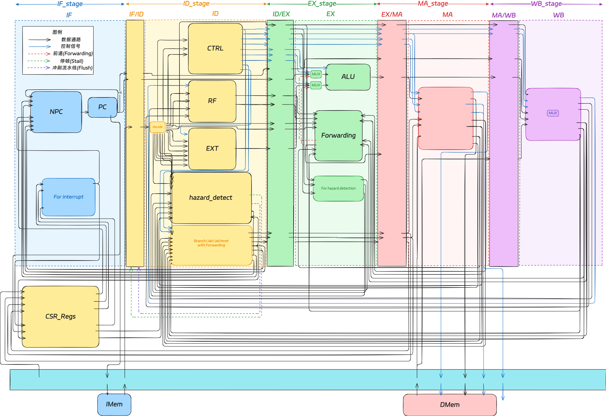
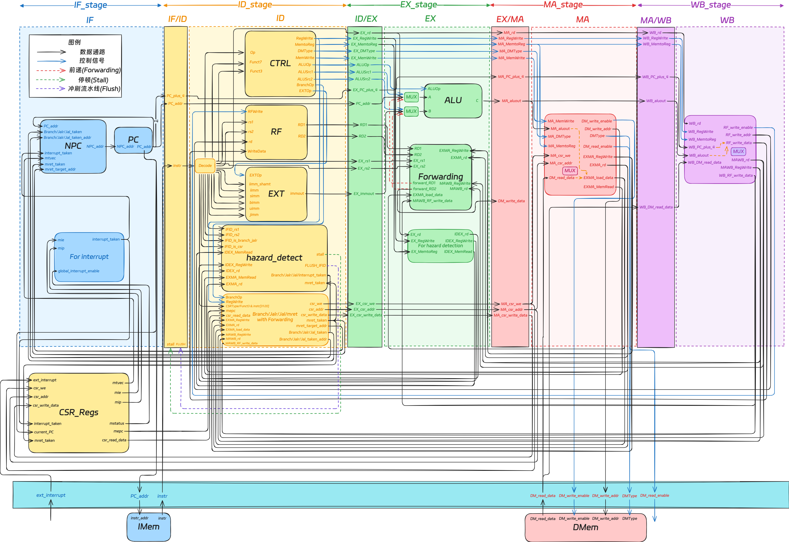

# 流水线 CPU

基于 RISC-V RV32I 指令集的五级流水线 CPU 实现，支持数据前推、冒险检测、外部中断，并集成 VGA 显示与 PS/2 键盘外设，构成完整 SoC 系统。

## 架构总览

五级流水线：**IF** (取指) → **ID** (译码) → **EX** (执行) → **MA** (访存) → **WB** (写回)

<p align="center">
  
</p>

各阶段核心模块：

| 阶段 | 核心模块 | 功能 |
|------|---------|------|
| IF | PC, NPC | 取指令、计算下一 PC（支持分支/中断/异常跳转） |
| ID | RF, EXT, ctrl, hazard\_detect | 指令译码、寄存器读取、立即数扩展、冒险检测 |
| EX | ALU, forwarding | 算术逻辑运算、地址计算、EX 级数据前推 |
| MA | dmem, CSR | 数据存储器读写、CSR 寄存器写入 |
| WB | MUX | 选择写回数据（ALU 结果 / 存储器数据 / PC+4） |

## 数据通路

<p align="center">
  
</p>

关键机制：

- **数据前推 (Forwarding)**：EX/MA 和 MA/WB 级结果前推到 EX 级 ALU 输入，消除数据冒险
- **冒险检测 (Hazard Detection)**：处理 Load-Use、ALU-Branch、Load-Branch、ALU-CSR 四种冒险，插入气泡阻塞
- **流水线冲刷**：分支跳转、JAL/JALR、mret、中断响应时冲刷 IF/ID 寄存器
- **中断机制**：外部中断通过 CSR 寄存器组（mstatus/mie/mip/mtvec/mepc/mcause）处理

## 目录结构

```
pipeline-cpu/
├── rtl/                  # RTL 源代码
│   ├── core/             # 流水线各阶段 (IF/ID/EX/MA/WB + pipeline_top)
│   ├── hazard/           # 数据前推与冒险检测
│   ├── include/          # 宏定义头文件 (definition.vh)
│   ├── top/              # SoC 顶层模块 (soc_top)
│   └── utils/            # 通用模块 (ALU/CSR/Controller/RegFile/Memory 等)
├── fpga/                 # FPGA 顶层及外设 (VGA/PS2/数码管/时钟分频)
├── tb/                   # Testbench
├── sim/                  # 仿真脚本与波形
├── asm/                  # 汇编应用程序
├── coe/                  # Vivado .coe 初始化文件
├── test/                 # 汇编测试程序 (冒险/转发验证)
├── docs/                 # 详细设计文档
├── scripts/              # 构建脚本
├── xdc/                  # FPGA 约束文件 (Nexys4 DDR)
└── given-asm/            # 参考汇编程序
```

## 快速开始

### 仿真

```powershell
cd pipeline-cpu
.\scripts\run_program_sim.ps1
```

或手动编译：

```bash
cd pipeline-cpu
iverilog -o sim/sim.vvp -f sim/sim.f tb/soc_top_tb.v
vvp sim/sim.vvp
```

### FPGA 下载

1. 打开 Vivado，以 `fpga/xgriscv_fpga_top.v` 为顶层模块
2. 添加约束文件 `xdc/Nexys4DDR_CPU.xdc`
3. 确保 `inst.txt`、`font_data.mem` 等文件在工程中
4. 综合 → 实现 → 生成 Bitstream → Program Device

### 切换程序

```powershell
.\scripts\build_program_image.ps1 -Program <程序名>
```

然后重新综合下载。可用程序：`fibonacci_vga`、`sorting_vga`、`snake`、`typing_vga` 等。

## 内置程序

| 程序 | 功能 | 特性 |
|------|------|------|
| fibonacci | 斐波那契数列 | CPU 计算 |
| fibonacci\_keyboard | 斐波那契 (键盘输入) | 键盘键入、VGA 显示 |
| sorting | 排序算法 | CPU 计算 |
| snake | 贪吃蛇游戏 | 键盘控制、VGA 显示 |
| typing\_vga | 打字练习 | 键盘键入、VGA 显示 |
| keyboard\_vga | 键盘测试 | 键盘键入、VGA 显示 |

程序源码位于 `asm/`，机器码位于 `coe/`。

## 技术文档

详细设计说明位于 `docs/` 目录：

| 文档 | 内容 |
|------|------|
| `pipeline_interfaces.md` | 流水线模块接口与连接详细文档 |
| `pipeline_overview_diagram.md` | 流水线总体设计框架图（AI 绘图提示词） |
| `soc_connection_diagram.md` | SoC 系统模块连接图（AI 绘图提示词） |
| `interrupt_mechanism.md` | 中断机制说明 |
| `keyboard_vga_test_guide.md` | VGA/Keyboard 测试指南 |
| `vivado_programming_flow.md` | Vivado 下板流程 |
